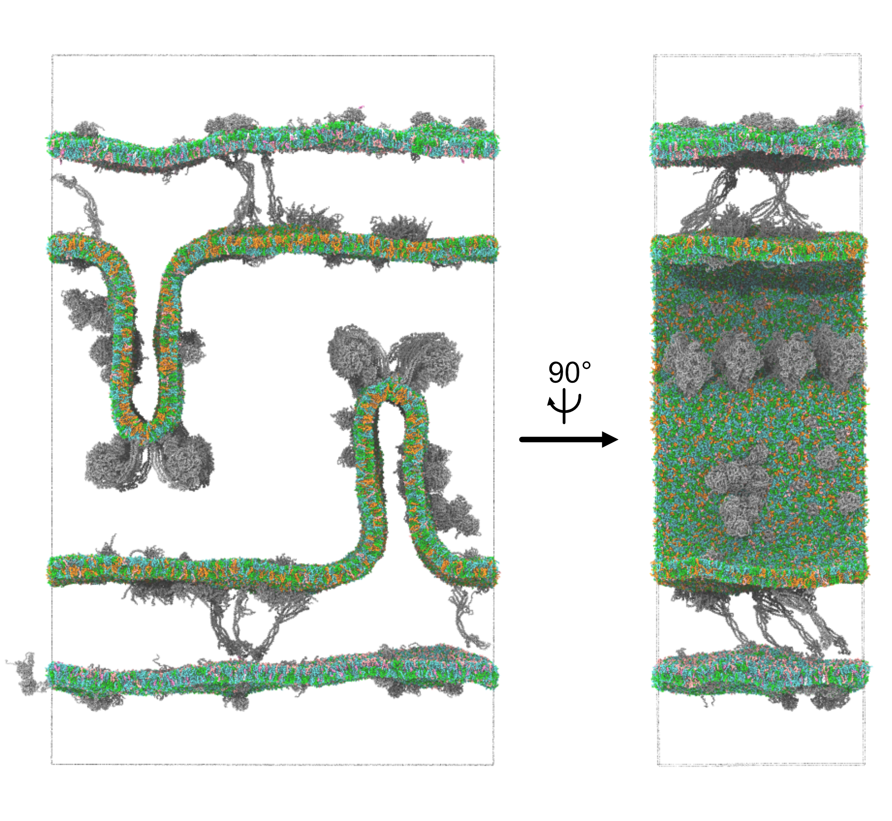

# An integrative modelling approach to the mitochondrial cristae

The link to the pre-print can be found [here](https://www.biorxiv.org/content/10.1101/2024.09.23.613389v1).
Please cite the below if you use anything from this repository:
> Brown, C. M., Westendorp, M. S., Zarmiento-Garcia, R., Stevens, J. A., Rouse, S. L., Marrink, S. J., & Wassenaar, T. A. (2024). An integrative modelling approach to the mitochondrial cristae. bioRxiv, 2024-09.

## Table of contents
- [Required programs](#required-programs)
- [Assembling the structures](#assembling-the-structures)
- [High-throughput simulations](#high-throughput-simulations)
- [Building the outer membrane](#building-the-outer-membrane)
- [Building the inner membrane](#building-the-inner-membrane)
- [Combining and simulating](#combining-and-simulating)
- [How to add to/change the system](#how-to-add-tochange-the-system)

The repository here should contain the information to set up the same systems, with details on how to perform each step. To do this some other programs are needed alongside gromacs and other more standard tools. 

## Required programs
- [vermouth-martinize](https://github.com/marrink-lab/vermouth-martinize)
- [bentopy](https://github.com/marrink-lab/bentopy)
- [TS2CG](https://github.com/marrink-lab/TS2CG)
- [insane](https://github.com/Tsjerk/Insane)

and for analysis
- [MDVoxelSegmentation](https://github.com/marrink-lab/MDVoxelSegmentation)
- [taw](https://github.com/Tsjerk/taw)

Below is a summary of the steps taken to assemble the system.

## Assembling the structures
More information on this is available in the full publication, but briefly every effort was made to include all residues from all included proteins that would be found in the mature form. The [PDB](https://www.rcsb.org/) was consulted for solved structures. Where there were residues missing, or only solved in a homologues species, the [AlphaFold2](https://www.nature.com/articles/s41586-021-03819-2) database (https://alphafold.ebi.ac.uk/) was used to place the complete subunits in the correct position using pymol, after removal of any signal sequences (as labelled on [UniProt](https://www.uniprot.org/)). Otherwise, the [ColabFold](https://colab.research.google.com/github/sokrypton/ColabFold/blob/main/AlphaFold2.ipynb) tool was used. In one instance, the [AlphaFold 3 server](https://alphafoldserver.com/) was used for a large complex with no solved structures. 

For post-translational modifications, the [charmm-gui](https://www.charmm-gui.org/) webserver can be used to add these where needed into the atomistic structure. 

To get the positioning within the membrane, the [OPM](https://opm.phar.umich.edu/) database can be consulted to see if the membrane positioning has already been calculated, or their [PPM webserver](https://opm.phar.umich.edu/ppm_server3_cgopm) can be used for new structures.

## High-throughput simulations 
High-throughput simulations should start from an orientated protein, with dummy atoms as the membrane to ensure correct placement. Then, either the `setup_inner_membrane_proteins.sh` or `setup_outer_membrane_proteins.sh` should be used to assemble small-scale simulations for each membrane protein. While each step is found within these bash scripts, the key commands will be shown here. For post-translational modifications, additional [mapping files](https://zenodo.org/records/10213934) need to be added to martinize from this recent [publication](https://pubs.acs.org/doi/full/10.1021/acs.jctc.3c00604)
> `martinize2 -f ${pdb_code}_clean.pdb -o topol.top -x ${cg_pdb} -ff martini3001 -maxwarn 10000 -elastic -ef 500 -eu 1.0 -el 0.5 -ea 0 -ep 0 -merge $chain_names || error_exit`

martinize converts atomistic (AT) protein structures to coarse-grained (CG) structures, and in this case, the Martini 3 forcefield (`-ff martini3001`) using an elastic network between all chains present in the protein with a force-constant of 500 kJ/mol/nm2. 

For the supercomplex, as this structure is so large each subunit was converted to CG representation and then combined afterwards, with a script to generate an elastic network for this. Each complex (e.g. Complex I, Complex III) of the supercomplex was treated separately. First, needed an AT representation of each subunit in the complex and then can run `Scripts/Supercomplex_elastic_network/martinize_subunits.sh`. The `Scripts/Supercomplex_elastic_network/Combine_itps.ipynb` and `Scripts/Supercomplex_elastic_network/combine_cg_structures.sh` can then be run to get the CG structure file and `.itp` without the inter-subunit elastic network. The `Scripts/Supercomplex_elastic_network/Create_elastic_network.ipynb` can then be used to generate this elastic network, and added into the overall `.itp` file.

When the protein is in a CG representation, this can then be embedded in a membrane.
For inner membrane proteins:
> `insane -u POPC:29 -u SAPE:36 -u PAPI:6 -u POPS:3 -u CDL2:26 -l POPC:58 -l SAPE:37 -l PAPI:5 -l POPS:3 -l CDL2:11 -au 0.83 -a 0.83 -d 10 -o system.gro -f ${cg_pdb} -pbc hexagonal -sol W -excl -1 2>&1 | tee -a topol.top`

And for outer membrane proteins
> `insane -u POPC:42.5 -u SAPE:32 -u PAPI:5 -u CHOL:15.5 -u PCER:5 -l POPC:52 -l SAPE:14 -l PAPI:19 -l CHOL:15 -d 10 -o system.gro -f ${cg_pdb} -pbc hexagonal -pr 0.01 -sol W -center -excl -1 2>&1 | tee -a topol.top`

After generating the membrane, the system is solvated and neutralised with NaCl ions, as well as adding 0.15 M NaCl. The system is then energy minimised and prepared for production runs. 

The simulations were then visually inspected to see if there was any membrane perturbation, and `Lipid_binding_sites.ipynb` was used to look at lipid density surrounding the proteins. 

A final frame for each of the proteins were taken to provide the CG structure for the next steps, with an annular lipid shell of ~1 nm. The resulting structures can be found in `Structures/Coarse_grain_structures`.

## Building the outer membrane
The outer membrane was constructed using bentopy, providing the CG structures with the lipid shells. The exact file provided can be found `Scripts/Bentopy/Outer_membrane.json`. The commands used were then
> `bentopy-pack Outer_membrane.json membrane_protein_placements.json --rearrange -v`

> `bentopy-render membrane_protein_placements.json membrane_proteins.gro -t topol.top`

The resulting file was then provided to insane as one structure file, using the `ring` flag to ensure that lipids are placed between the proteins
>`insane -f membrane_proteins.gro -u POPC:42.5 -u SAPE:32 -u PAPI:5 -u CHOL:15.5 -u PCER:5 -l POPC:52 -l SAPE:14 -l PAPI:19 -l CHOL:15 -pbc rectangular -x 67 -y 67 -z 40 -dm -20 -ring -fudge 0.05 -o lipid_protein.gro`

As this inserts lipids into the $\beta$-barrels present, lipids were manually deleted using pymol and then updating the topology. The system was then solvated and ions were added in the same manner as the previous step. This was then simulated for 1 &mu;s.

## Building the inner membrane
In order to create an artificial surface to place the lipids and proteins, the 3D-modelling software [blender](https://www.blender.org/) was used, the files can be found `Structures/Blender`. The measurements and distances were based on experimental values as closely as possible. The shape was then saved as a `.obj` file. This can then be converted to a `.tsi` file to supply to TS2CG
> `python obj_to_tsi.py -i Cristae_extend.obj -o Cristae_extend.tsi -box 20 20 20`

The protein placements at the cristae sides were generated with bentopy (with the file `Scripts/Bentopy/Inner_membrane.json`) and the same commands as for the outer membrane. The structures were used in the next steps as `Cristae_side_1.gro` and `Cristae_side_2.gro`.

The following command can be used with `-Mashno 0` to see which vertices to add the proteins to by changing the inclusion section of the `.tsi` files (see TS2CG documentation and tutorials for more information).
> `PLM -TSfile Cristae_extend.tsi -bilayerThickness 3 -rescalefactor 5 5 5 -Mashno 3`

This method generates a few `NaN` values which can be removed from the `point/innerBM.dat` and `point/OuterBM.dat` files using the `Scripts/Inner_membrane_building/remove_nan_gro.sh` file. 

The CG representation can then be generated using the TS2CG command
> `PCG -str input_inner_mitochondrial_membrane.str -Bondlength 0.2 -LLIB Martini3.LIB -defout system`

The `topol.top` file needs to be edited to account for the proteins included in the cristae sides, the ATPase row and the lipids surrounding the proteins. 

This method with the inputs provided often included lipids that are overlapping, which can be detected using a bentopy command and then removed
> `python check_overlap_remove_residue.py system.gro`

The system can then be solvated, ions added and energy minimised. This was then simulated for 1 &mu;s.

## Combining and simulating 
In order to combine the membranes, the two systems need to have similar xy dimensions (semiisotropic coupling is used). This can be measured simply using
>`gmx energy -f md.edr -o box-xy.xvg` and selecting `Box-X`

Both membranes had the solvent and ions removed from their system before performing the following steps. To combine the membranes into one coordinate file, the outer membrane was shifted to the correct distance using
> `gmx editconf -f Outer.gro -o Outer.gro -translate 0 0 50`

and saved with the inner membrane in pymol. The topol.top file needs to be changed to add the outer membrane constituents. Then change the box size to add enough room in the z-dimension
> `gmx editconf -f membranes_combined.pdb -c -box 64 64 115 -o membranes_combined_box.pdb`

The system is then ready to add solvent, ions and perform an energy minimization step. This was then simulated for 4 &mu;s.

Analysis scripts can be found in `Scripts/Analysis`, including the inputs for `MDVoxelSegmentation` which produces the `clusters.npy` file that other analysis scripts rely upon.

## How to add to/change the system
To add new membrane proteins in the system, go through the steps in [High-throughput simulations](#high-throughput-simulations). If there is not already have a structure, otherwise go through the steps in [Assembling the structures](#assembling-the-structures). 
The user can then take the final protein coordinates with surrounding lipids and .itp file to continue with the procedure. 

#### To add an outer membrane protein:
The file that would need to change is `Scripts/Bentopy/Outer_membrane.json`, adding the path to the .itp file in `"topol_includes"` and then the protein information in `"segments"`. Otherwise, the procedure listed in [Building the outer membrane](#building-the-outer-membrane) should be the same.

#### To add an inner membrane protein:
The placement of the protein will determine which file needs to be changed. If the protein is found in the flat cristae sides, the `Scripts/Bentopy/Inner_membrane.json`, adding the path to the .itp file in `"topol_includes"` and then the protein information in `"segments"`.
If the protein is found elsewhere, the inclusions in the .tsi file given to TS2CG need to be changed, see [TS2CG](https://github.com/marrink-lab/TS2CG) or [Building the inner membrane](#building-the-inner-membrane) for further information on how to select indices and include the protein structure files. The rest of the steps can be followed in [Building the inner membrane](#building-the-inner-membrane). 

#### To change the membrane shape:
If a different inner membrane shape is desired, the shape can be generated using the 3D-modelling software [blender](https://www.blender.org/) and saved as a triangulated surface, which then can be used in the steps described in [Building the inner membrane](#building-the-inner-membrane). 

### Enjoy!!
