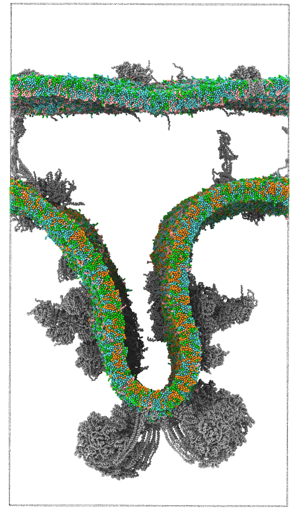

# An integrative modelling approach to the mitochondrial cristae

The link to the pre-print can be found [here](https://www.biorxiv.org/content/10.1101/2024.09.23.613389v1) 
Please cite the below if you use anything from this repository:
> Brown, C. M., Westendorp, M. S., Zarmiento-Garcia, R., Stevens, J. A., Rouse, S. L., Marrink, S. J., & Wassenaar, T. A. (2024). An integrative modelling approach to the mitochondrial cristae. bioRxiv, 2024-09.

The repository here should contain the information to set up the same systems, with details on how to perform each step. In order to do this some other programmes are needed alongside gromacs and other more standard tools. 

## Required programmes
- [vermouth-martinize](https://github.com/marrink-lab/vermouth-martinize)
- [bentopy](https://zenodo.org/records/13818758)
- [TS2CG](https://github.com/marrink-lab/TS2CG)
- [insane](https://github.com/Tsjerk/Insane)

and for analysis
- [MDVoxelSegmentation](https://github.com/marrink-lab/MDVoxelSegmentation)
- [taw](https://github.com/Tsjerk/taw)

Below is a summary of the steps taken to assemble the system.

### Assembling the structures
Brief explination here

### High-throughput simulations 
High-throughput simulations should start from an orientated protein, with dummy atoms as the membrane to ensure correct placement. Then, either the `setup_inner_membrane_proteins.sh` or `setup_outer_membrane_proteins.sh` should be used to assemble small scale simulations for each membrane protein. While each step is found within these bash scripts, the key commands will be shown here.
> `martinize2 -f ${pdb_code}_clean.pdb -o topol.top -x ${cg_pdb} -ff martini3001 -maxwarn 10000 -elastic -ef 500 -eu 1.0 -el 0.5 -ea 0 -ep 0 -merge $chain_names || error_exit`

martinize converts atomistic (AT) protein structures to coarse-grained (CG) strucutres, and in this case the Martini 3 forcefield (`-ff martini3001`) using an elastic network between all chains present in the protein with a force-constant of 500 kJ/mol/nm2. When the protein is in a CG representation, this can then be embedded in a membrane.
For inner membrane proteins:
> `insane -u POPC:29 -u SAPE:36 -u PAPI:6 -u POPS:3 -u CDL2:26 -l POPC:58 -l SAPE:37 -l PAPI:5 -l POPS:3 -l CDL2:11 -au 0.83 -a 0.83 -d 10 -o system.gro -f ${cg_pdb} -pbc hexagonal -sol W -excl -1 2>&1 | tee -a topol.top`

And for outer membrane proteins
> `insane -u POPC:42.5 -u SAPE:32 -u PAPI:5 -u CHOL:15.5 -u PCER:5 -l POPC:52 -l SAPE:14 -l PAPI:19 -l CHOL:15 -d 10 -o system.gro -f ${cg_pdb} -pbc hexagonal -pr 0.01 -sol W -center -excl -1 2>&1 | tee -a topol.top`

After generating the mebrane, the system is solvated and neutralised with NaCl ions, as well as adding 0.15 M NaCl. The system is then energy minimised and prepared for production runs. 

The simulations were then visually inspected to see if there was any membrane purtubation, and `Lipid_binding_sites.ipynb` used to look at lipid density surrounding the proteins. 

A final frame ofr each of the proteins were taken to provide the CG structure for the next steps, with an annualar lipid shell of ~1 nm. The resulting structures can be found in `Structures/Coarse_grain_structures`.

### Building the outer membrane
The outer membrane was constructed using bentopy, providing the CG structures with the lipid shells. The exact file provided can be found `Scripts/Bentopy/Outer_membrane.json`. The commands used were then
> `bentopy-pack Outer_membrane.json membrane_protein_placements.json --rearrange -v`

> `bentopy-render membrane_protein_placements.json membrane_proteins.gro -t topol.top`

The resulting file was then provided to insane as one structure file, using the `ring` flag to ensure that lipids are placed between the proteins
>`insane -f membrane_proteins.gro -u POPC:42.5 -u SAPE:32 -u PAPI:5 -u CHOL:15.5 -u PCER:5 -l POPC:52 -l SAPE:14 -l PAPI:19 -l CHOL:15 -pbc rectangular -x 67 -y 67 -z 40 -dm -20 -ring -fudge 0.05 -o lipid_protein.gro`

As this inserts lipids into the $\beta$-barrels present, lipids were manually deleted using pymol and then updating the topology. 

### Building the inner membrane
Brief explination here

### Combining and simulating 
